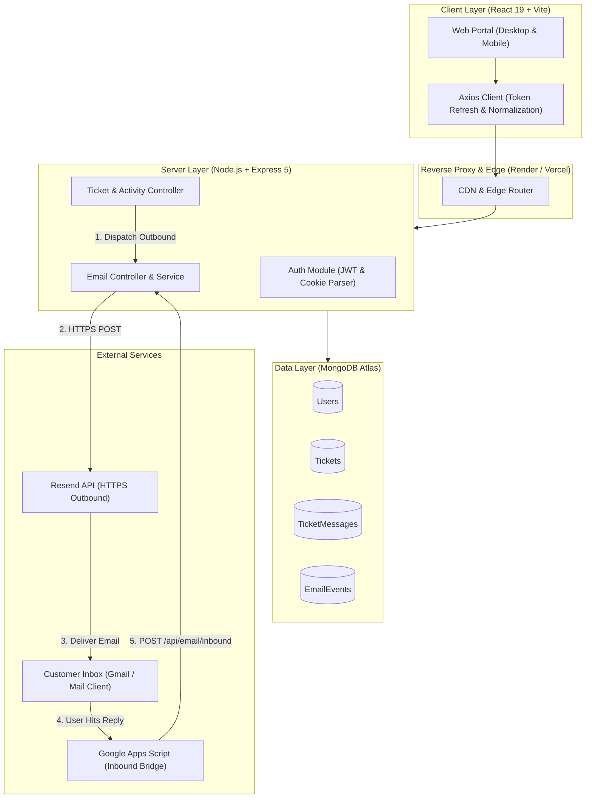
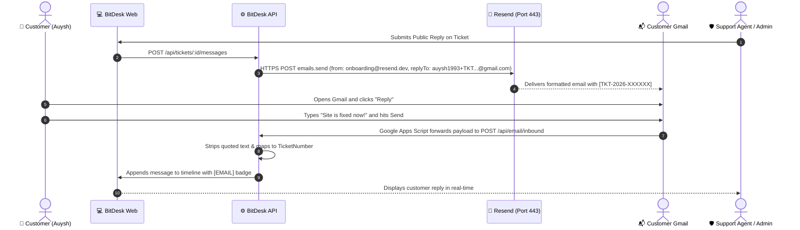

<div align="center">

# 🎫 BitDesk

### Modern Enterprise Support Ticketing & 2-Way Email Helpdesk System

BitDesk is a full-stack, enterprise-grade customer support platform built on the MERN stack. It bridges the gap between modern browser-based web portals and real-world email inboxes, featuring seamless 2-way email synchronization, role-based access control, collision locking, and high-performance transactional email delivery.

[](https://nodejs.org)
[](https://www.typescriptlang.org)
[](https://react.dev)
[](https://vitejs.dev)
[](https://expressjs.com)
[](https://www.mongodb.com)
[](https://tailwindcss.com)

</div>

---

## 📑 Table of Contents
- [Key Features](#-key-features)
- [System Architecture](#-system-architecture)
- [2-Way Email Sync Lifecycle](#-2-way-email-sync-lifecycle)
- [Tech Stack](#-tech-stack)
- [Database Schema & Roles](#-database-schema--roles)
- [Getting Started](#-getting-started)
  - [Prerequisites](#prerequisites)
  - [Environment Configuration](#environment-configuration)
  - [Installation & Local Run](#installation--local-run)
  - [Database Reset & Seeding](#database-reset--seeding)
- [API Reference](#-api-reference)
- [2-Way Email Integration Guide](#-2-way-email-integration-guide)
  - [Outbound (Resend API)](#1-outbound-resend-api)
  - [Inbound (Gmail Apps Script Bridge)](#2-inbound-gmail-apps-script-bridge)
- [Production Deployment](#-production-deployment)
- [License](#-license)

---

## 🌟 Key Features

### 1. Robust Role-Based Access Control (RBAC)
- **Three Distinct Personas**:
  - **Administrator (`admin`)**: Full platform control, ticket reassignments, category setup, and staff approval management.
  - **Support Agent (`agent`)**: Claims unassigned tickets, posts internal notes, sends public replies to owned tickets, and updates statuses.
  - **Customer (`customer`)**: Self-service portal to create tickets, view ticket history, and track resolution timelines.
- **Staff Approval Security Gate**: Agents and Admins who register are held in an unapproved state (`isApproved: false`) until an existing Administrator approves them via the `/users` dashboard.

### 2. High-Deliverability Outbound Emailing
- **Cloud Firewall Bypass**: Outbound emails are dispatched over standard HTTPS (Port 443) via **Resend**, bypassing cloud host egress SMTP port blocks (`25`, `465`, `587` on Render, AWS, Vercel).
- **RFC Standard Email Threading**: Every notification automatically injects `In-Reply-To`, `References`, and ticket identifiers to preserve inbox grouping across Gmail, Outlook, and Apple Mail.
- **Admin Alerts**: Automatically notifies all Administrators whenever a customer opens a new ticket or replies to an unassigned ticket.

### 3. Inbound 2-Way Email Synchronization
- **Email-to-Ticket Parsing**: Customers can simply click **Reply** in their Gmail/Outlook inbox. BitDesk parses the inbound payload, extracts the ticket reference `[TKT-YYYY-XXXXXX]`, cleans quoted email history, and appends the message to the active conversation.
- **Visual Source Identifiers**: Clear indicators distinguish messages composed on the **Web** from messages ingested via **Email**.
- **Auto-Reopen Mechanism**: If a customer replies to a `RESOLVED` or `CLOSED` ticket, BitDesk automatically transitions the ticket to `REOPENED` and notifies staff.

### 4. Collision Prevention & Internal Collaboration
- **Single-Assignee Ownership**: Non-assigned support agents cannot inadvertently post public replies to tickets owned by other staff members.
- **Internal Notes**: Support staff can post internal, yellow-badged private notes visible exclusively to agents and admins (never exposed to customers).
- **Audit Trails**: Every assignment, status transition, and note is recorded in `TicketActivity` and displayed in the timeline.

---

## 🏗 System Architecture



---

## 🔁 2-Way Email Sync Lifecycle



---

## 💻 Tech Stack

| Layer | Technologies |
| :--- | :--- |
| **Frontend** | React 19, TypeScript, Vite, Tailwind CSS, Lucide React, Axios, React Router DOM v7 |
| **Backend** | Node.js (v20+), Express 5, TypeScript (`tsx`), Mongoose, JSON Web Tokens (`jsonwebtoken`), bcryptjs, Helmet, Cookie-Parser, CORS |
| **Database** | MongoDB Atlas (Cluster 0) |
| **Email Services** | Resend API (HTTP REST SDK), Nodemailer (Local Fallback), Google Apps Script (IMAP/Webhook Bridge) |
| **Deployment** | Render (Web Service & Static Site), Vercel, Git CI/CD |

---

## 🗄 Database Schema & Roles

### Collections

- **`User`**: Manages credentials, roles (`admin`, `agent`, `customer`), verification status (`isVerified`), and admin approval status (`isApproved`).
- **`Ticket`**: Stores `ticketNumber` (`TKT-YYYY-XXXXXX`), `subject`, `description`, `status`, `priority`, `category`, and `assignedTo`.
- **`TicketMessage`**: Threaded replies containing `body`, `type` (`PUBLIC` vs `INTERNAL`), `senderRole`, and `source` (`WEB` vs `EMAIL`).
- **`TicketActivity`**: Immutable audit logs capturing every status change, assignment, note addition, and email ingest.
- **`Category`**: Active support departments (e.g., Technical Support, Billing, Account & Access).
- **`EmailEvent`**: Comprehensive delivery ledger tracking outbound and inbound message IDs, provider responses, and errors.

---

## 🚀 Getting Started

### Prerequisites
- **Node.js** (v20.x or higher)
- **npm** (v10+)
- **MongoDB Atlas** database URI
- **Resend** account & API key ([resend.com](https://resend.com))

---

### Environment Configuration

#### 1. Backend (`server/.env`)
Create a `.env` file inside the `server/` directory:

```env
PORT=5000
NODE_ENV=development
CORS_ORIGIN=http://localhost:5173

# MongoDB Connection
MONGO_URI=mongodb+srv://<username>:<password>@cluster0.tjhrxe3.mongodb.net/Bitdesk?appName=Cluster0

# Authentication (JWT)
JWT_ACCESS_SECRET=your_jwt_access_secret_key_minimum_32_characters
JWT_ACCESS_EXPIRES_IN=15m
JWT_REFRESH_SECRET=your_jwt_refresh_secret_key_minimum_32_characters
JWT_REFRESH_EXPIRES_IN=7d
OTP_EXPIRES_MINUTES=10

# Email Delivery (Resend API)
RESEND_API_KEY=re_your_resend_api_key_here
EMAIL_FROM="BitDesk Support <onboarding@resend.dev>"

# SMTP Fallback (Optional)
SMTP_HOST=smtp.gmail.com
SMTP_PORT=587
SMTP_USER=your_email@gmail.com
SMTP_PASS=your_gmail_app_password
```

#### 2. Frontend (`client/.env`)
Create a `.env` file inside the `client/` directory:

```env
VITE_API_URL=http://localhost:5000/api
```

---

### Installation & Local Run

#### 1. Clone the repository
```bash
git clone https://github.com/auysh8/BitDesk.git
cd BitDesk
```

#### 2. Install dependencies
```bash
# Install backend dependencies
cd server
npm install

# Install frontend dependencies
cd ../client
npm install
```

#### 3. Start development servers
In terminal 1 (Backend):
```bash
cd server
npm run dev
```

In terminal 2 (Frontend):
```bash
cd client
npm run dev
```

The frontend will be live at `http://localhost:5173` and the API at `http://localhost:5000/api`.

---

### Database Reset & Seeding

BitDesk includes a complete database reset script that clears old test entries, provisions 4 support categories, and creates 3 verified & approved users for all roles.

Run the script from `server/`:
```bash
npx tsx src/database/reset-app.ts
```

#### Default Credentials
> **Global Password for all accounts**: `Password123!`

| Role | Name | Email |
| :--- | :--- | :--- |
| **Admin** | Pankaj Bhandari | `pankajbhandari0714@gmail.com` |
| **Agent** | Auysh Agent | `auysh1993@gmail.com` |
| **Customer** | Auysh Customer | `auysh1652@gmail.com` |

---

## 📡 API Reference

### Authentication (`/api/auth`)
| Method | Endpoint | Description | Auth |
| :--- | :--- | :--- | :--- |
| `POST` | `/api/auth/register` | Register new account (staff accounts default to unapproved) | Public |
| `POST` | `/api/auth/login-password` | Sign in with email & password | Public |
| `POST` | `/api/auth/request-otp` | Request a 6-digit one-time passcode | Public |
| `POST` | `/api/auth/verify-otp` | Verify OTP and authenticate | Public |
| `POST` | `/api/auth/refresh-token` | Exchange refresh cookie for new access token | Public |
| `POST` | `/api/auth/logout` | Revoke tokens and clear cookies | Authenticated |

### Tickets (`/api/tickets`)
| Method | Endpoint | Description | Role |
| :--- | :--- | :--- | :--- |
| `GET` | `/api/tickets` | List tickets with search, filtering, and pagination | All |
| `POST` | `/api/tickets` | Create a new support ticket | Customer / Admin |
| `GET` | `/api/tickets/:id` | Get ticket details and timeline | Requester / Staff |
| `PATCH` | `/api/tickets/:id/status` | Update ticket status (`IN_PROGRESS`, `RESOLVED`, etc.) | Staff |
| `POST` | `/api/tickets/:id/assign` | Assign or claim ticket | Staff |
| `GET` | `/api/tickets/:id/messages`| Fetch threaded conversation | Requester / Staff |
| `POST` | `/api/tickets/:id/messages`| Post public reply or internal note | Requester / Staff |

### Email Webhook (`/api/email`)
| Method | Endpoint | Description | Auth |
| :--- | :--- | :--- | :--- |
| `POST` | `/api/email/inbound` | Ingest and process inbound emails from mail bridges | Public |

### User Management (`/api/users`)
| Method | Endpoint | Description | Role |
| :--- | :--- | :--- | :--- |
| `GET` | `/api/users/staff` | List all available agents and admins | Staff |
| `GET` | `/api/users` | List platform users with approval filters | Admin |
| `PATCH` | `/api/users/:id/approve` | Approve a staff account for sign in | Admin |

---

## ✉️ 2-Way Email Integration Guide

### 1. Outbound (Resend API)
1. Sign up at [resend.com](https://resend.com).
2. Go to **API Keys** ➔ **Create API Key**.
3. Set `RESEND_API_KEY=re_...` in your server environment variables.
4. *(Optional)* Add and verify your custom domain in Resend to send from `support@yourdomain.com`. By default, BitDesk safely uses `BitDesk Support <onboarding@resend.dev>`.

---

### 2. Inbound (Gmail Apps Script Bridge)
Because personal Gmail accounts do not support native webhooks, BitDesk uses a lightweight Google Apps Script running on your Gmail account that detects incoming replies and forwards them to your backend.

1. Open [script.google.com](https://script.google.com) and click **New Project**.
2. Replace all code in `Code.gs` with:

```javascript
function forwardGmailRepliesToBitDesk() {
  const WEBHOOK_URL = "https://bitdesk.onrender.com/api/email/inbound";
  
  // Search for the latest ticket reply threads
  const threads = GmailApp.search("subject:TKT-", 0, 5);
  
  for (const thread of threads) {
    const messages = thread.getMessages();
    for (const message of messages) {
      if (message.isUnread()) {
        const payload = {
          from: message.getFrom(),
          to: message.getTo(),
          subject: message.getSubject(),
          text: message.getPlainBody(),
          html: message.getBody(),
          messageId: "<" + message.getId() + "@gmail.com>"
        };
        
        const options = {
          method: "post",
          contentType: "application/json",
          payload: JSON.stringify(payload),
          muteHttpExceptions: true
        };
        
        try {
          const response = UrlFetchApp.fetch(WEBHOOK_URL, options);
          Logger.log("BitDesk API Response: " + response.getContentText());
          message.markRead(); // Prevents forwarding duplicate replies
        } catch (e) {
          Logger.log("Error sending to BitDesk: " + e.toString());
        }
      }
    }
  }
}
```
3. Click **Save (Ctrl + S)** and run `forwardGmailRepliesToBitDesk` once to grant permissions (*Click Advanced ➔ Go to project (unsafe) ➔ Allow*).
4. Click the **⏰ Triggers** tab on the left ➔ **+ Add Trigger**:
   - Event Source: `Time-driven`
   - Trigger type: `Minutes timer`
   - Interval: `Every minute`
5. Click **Save**. Any response sent to a ticket email in Gmail will automatically show up inside BitDesk within 60 seconds!

---

## 🌐 Production Deployment

### Backend on Render (Web Service)
1. Create a **Web Service** on Render connected to your GitHub repository.
2. Settings:
   - **Root Directory**: `server`
   - **Build Command**: `npm install`
   - **Start Command**: `npx tsx src/server.ts`
3. Environment Variables:
   - `MONGO_URI`: `your_mongodb_atlas_connection_string`
   - `JWT_ACCESS_SECRET`: `secure_secret_key`
   - `JWT_REFRESH_SECRET`: `secure_secret_key`
   - `RESEND_API_KEY`: `re_your_api_key`
   - `CORS_ORIGIN`: `https://your-frontend.onrender.com,https://your-frontend.vercel.app`

---

### Frontend on Render (Static Site)
1. Create a **Static Site** on Render connected to your GitHub repository.
2. Settings:
   - **Root Directory**: `client`
   - **Build Command**: `npm run build`
   - **Publish Directory**: `dist`
3. Environment Variables:
   - `VITE_API_URL`: `https://bitdesk.onrender.com/api`
4. **Important SPA Rewrite Rule**:
   - Go to **Redirects/Rewrites** in the Render sidebar.
   - Add rule: `/*` ➔ `/index.html` with Action **`Rewrite`**.

---

### Frontend on Vercel
1. Import repository on [vercel.com](https://vercel.com).
2. Set **Root Directory** to `client`.
3. Set Environment Variable: `VITE_API_URL=https://bitdesk.onrender.com/api`.
4. Deploy! `client/vercel.json` already contains the SPA routing rewrites.

---

## 📄 License
This project is open-source and available under the [MIT License](LICENSE).
